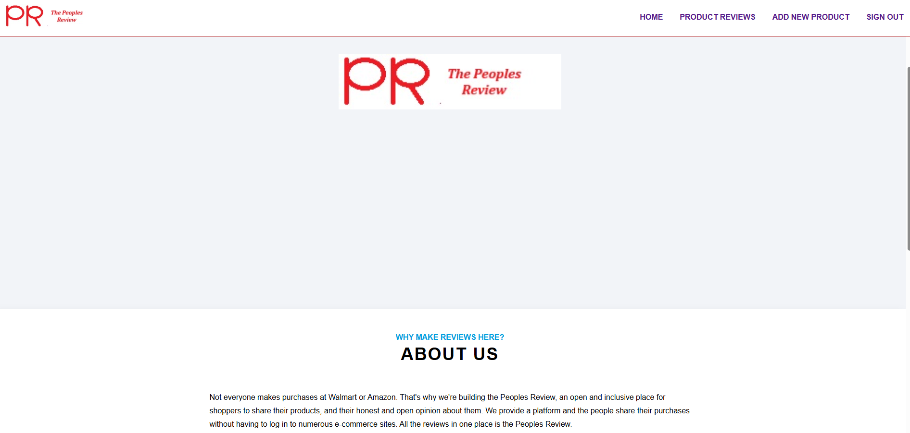
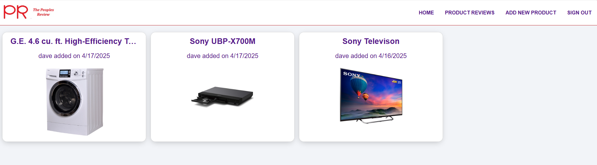
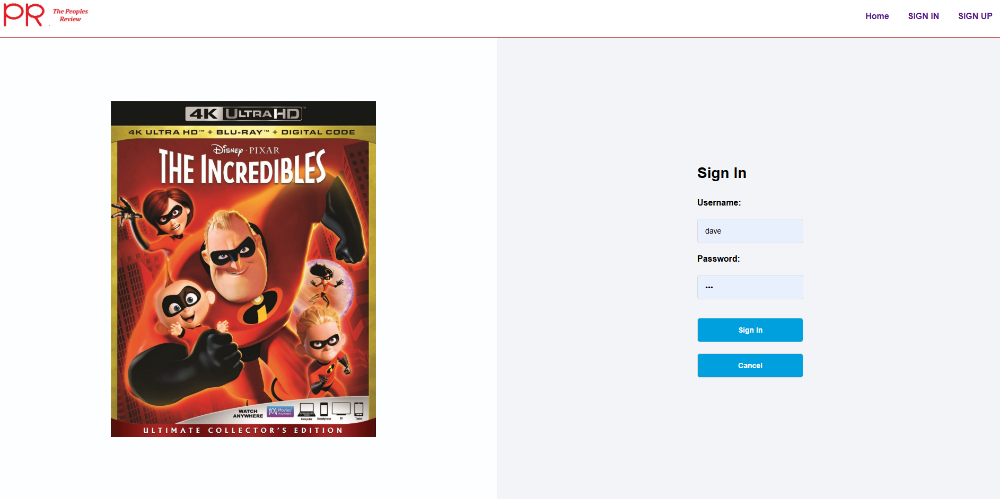
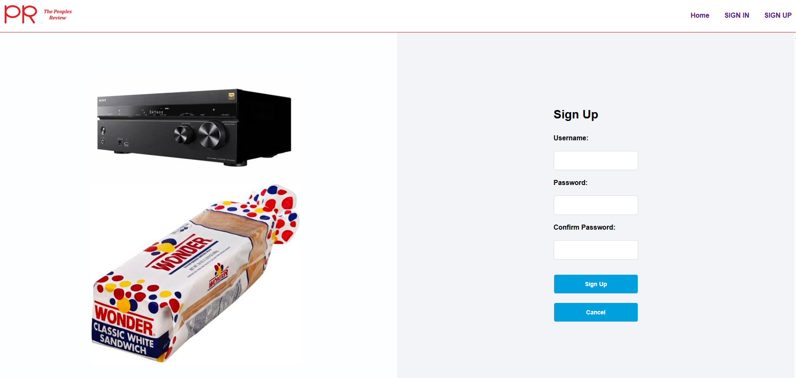

# The Peopls Review - Frontend

## Table of Contents
- [Overview](#overview)
- [Features](#features)
- [Technologies Used](#technologies-used)
- [Screenshots](#screenshots)
- [Next Steps](#next-steps)
- [Team](#team)

## Overview
Not everyone makes purchases at Walmart or Amazon. That's why we're
building the Peoples Review, an open and inclusive place for shoppers
to share their products, and their honest and open opinion about them.
We provide a platform and the people share their purchases without
having to log in to numerous e-commerce sites.  All the reviews in one
place is the Peoples Review.

## Features
- **Add Your Own Products**: This app allows the user to post and review their own products
- **User Authentication**: Secure sign-up, login, and logout functionality
- **Edit and Delete Products and Reviews**: User can edit and delete product and reviews
- **See Other Peoples Reviews and Products**: User can see other peoples reviews and respond with their own review
- **Other Users Reviews Are Read Only**: I can not alter anther users review, but can respond to it

## Technologies Used

- React
- React Router
- Vite
- Node.js (v16 or higher)
- npm

## Screenshots

## Next Steps

- Add the ability to sort reviews by catagory
- Add the ability to search for product
- Add a product API from Best Buy, Walmart, and Amazon

## Team

- Jerry Spann

## Deployment

